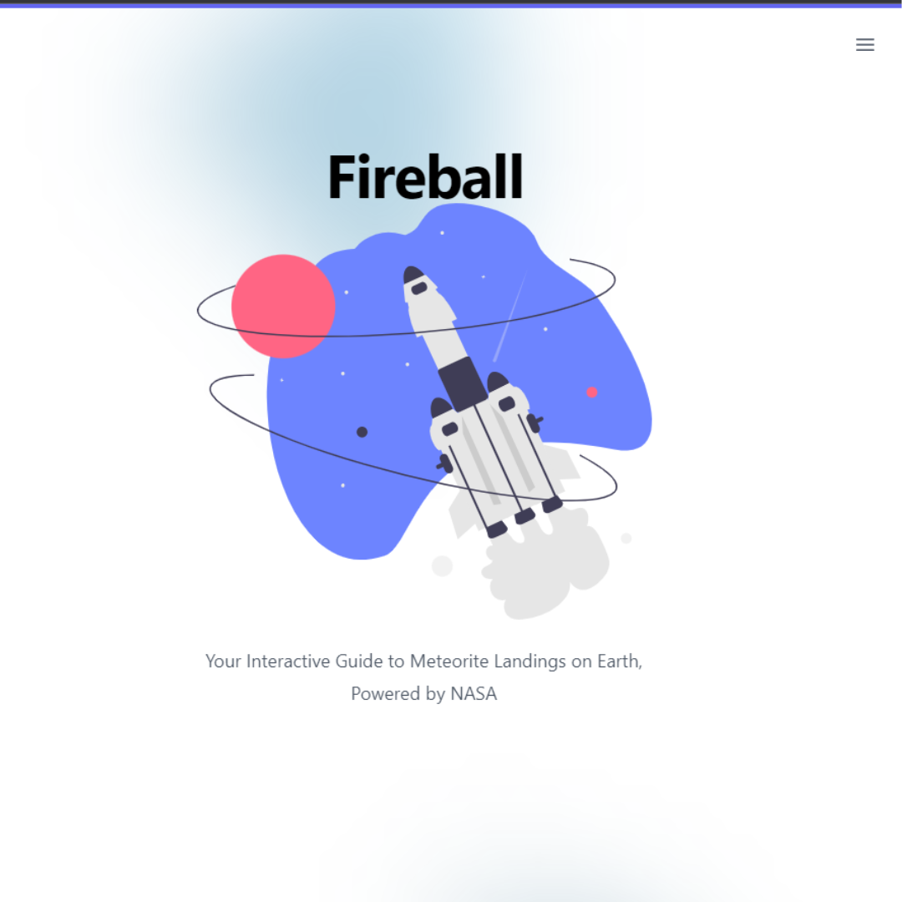
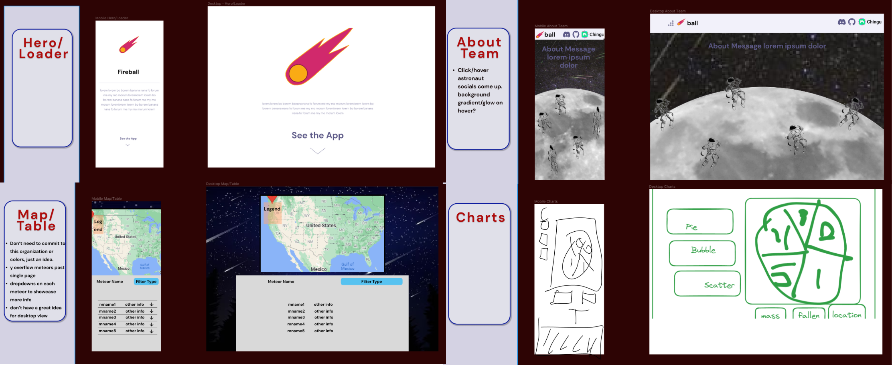
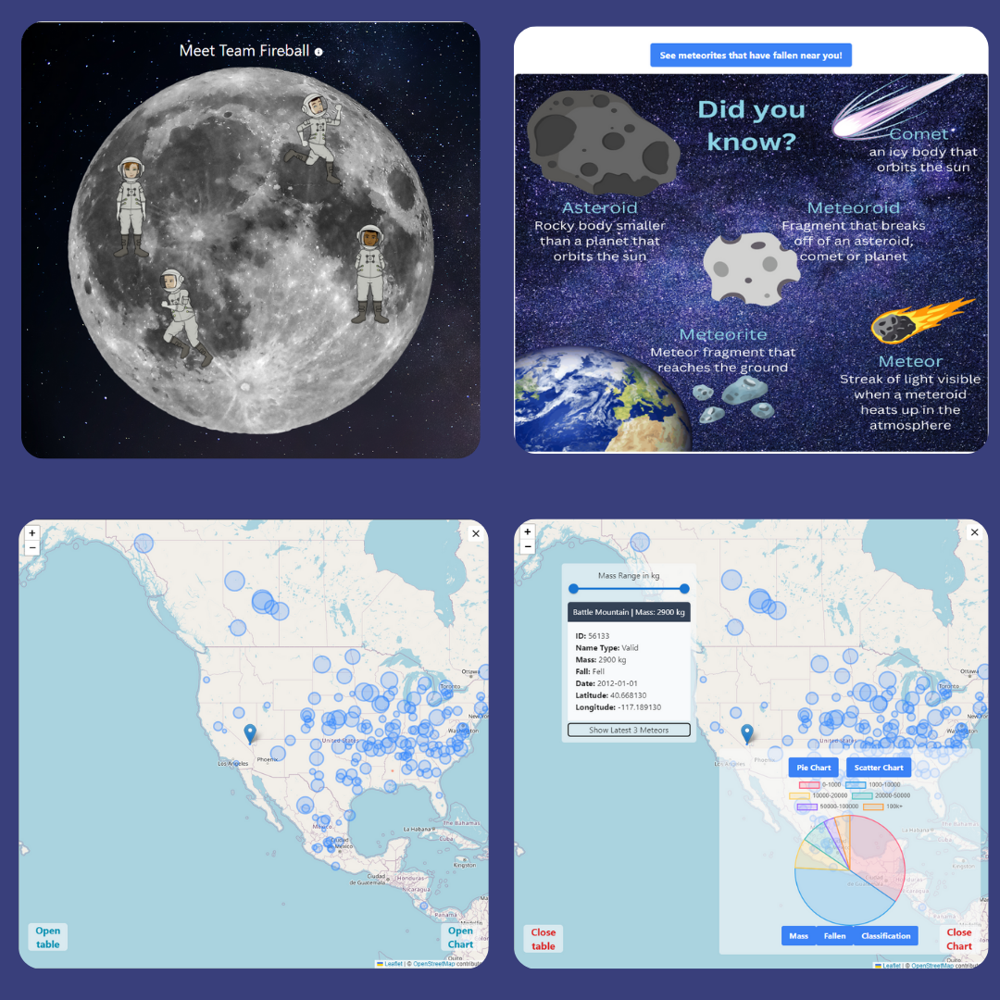

# Fireball


<h3 align="center">Meteorite Landing Data</h3>

  <p align="center">
    This app was created for <a href="https://www.chingu.io/">Chingu's</a> Voyage 45 Tier 2. It pulls data from <br />
    <a href="https://data.nasa.gov/Space-Science/Meteorite-Landings/gh4g-9sfh"><strong>NASA's Open Data Portal Meteorite Landings API</strong></a>
    <br />
    <br />
    <br />
    <a href="https://v45-tier2-team-24.vercel.app/">View Live</a>
  </p>


<!-- ABOUT THE PROJECT -->
## About The Project


<div align="center"></div>


### Built With


- This is a React App created with Vite

- Add-on packages include: <br>

  1. [Chart.js](https://www.chartjs.org/)
  2. [React-Chartjs-2](https://react-chartjs-2.js.org/)
  3. [React-Leaflet](https://react-leaflet.js.org/)
  4. [Prettier](https://www.npmjs.com/package/prettier)
  5. [MaterialUI](https://mui.com/)
     
- Fonts from [Google Fonts](https://fonts.google.com/)

- Icons from [Material Icons](https://mui.com/material-ui/material-icons/)

- Styled with [TailwindCSS](https://tailwindcss.com/)

- Testing with [React Testing Library](https://testing-library.com/docs/react-testing-library/intro/)

- Wireframed with [Figma](https://www.figma.com/file/FLlxPnVMk3nqMldskjmbOe/Website-Wireframes-UI-Kit-%7C-BRIX-Templates-(Community)?type=design&node-id=0-1&mode=design&t=ZSQTXr4qjiCtRwJb-0)

<div align="center"></div>  

### Features


- The data is sorted and displayed into both a pie chart and a scatter plot. Users can change the range of the X and Y axis on the scatter plot and also choose which data to view in the pie chart. 

- A user's location is obtained when the application loads and that location is used to center the map that opens in a modal.

- Within the map component, a user can click on dots representing meteorites that have fallen near them. There is a table where the chosen meteorite's data is displayed. 

- On the Team component a user can hover over or tap on one of the astronaut avatars to learn more about each developer that worked on the project.

<div align="center"></div>
  


<!-- GETTING STARTED -->
## Getting Started

### Installation

1. Clone the repo
   ```sh
   git clone https://github.com/chingu-voyages/v45-tier2-team-24.git
   ```
3. Install NPM packages
   ```sh
   npm install
   ```
4. Run NPM run dev
   ```js
   npm run dev
   ```


<!-- CONTACT -->
## Contact
<i><strong>Christopher Conway</strong></i><br/>
&nbsp;&nbsp;&nbsp;&nbsp;christopherjconway07@gmail.com<br/> 
&nbsp;&nbsp;&nbsp;&nbsp;[Portfolio](https://christopherjconway.netlify.app/)<br/>
&nbsp;&nbsp;&nbsp;&nbsp;[GitHub](https://github.com/ConwayCJ)<br/>
&nbsp;&nbsp;&nbsp;&nbsp;[LinkedIn](https://www.linkedin.com/in/conwaycj/)<br/>
<br/>
<i><strong>Yodae Lim</strong></i><br/>
&nbsp;&nbsp;&nbsp;&nbsp;yodae.lim@gmail.com <br/> 
&nbsp;&nbsp;&nbsp;&nbsp;[GitHub](https://github.com/limyod)<br/>
&nbsp;&nbsp;&nbsp;&nbsp;[LinkedIn](https://www.linkedin.com/in/yodae-lim/)<br/>
<br/>
<i><strong>Carlos Luevano</strong></i><br/>
&nbsp;&nbsp;&nbsp;&nbsp;dm.carlosluevano@gmail.com <br/> 
&nbsp;&nbsp;&nbsp;&nbsp;[Portfolio](https://carlosluevano.netlify.app/)<br/>
&nbsp;&nbsp;&nbsp;&nbsp;[GitHub](https://github.com/Clue355)<br/>
&nbsp;&nbsp;&nbsp;&nbsp;[LinkedIn](https://www.linkedin.com/in/carlos-luevano/)<br/>
<br/>
<i><strong>Rachel VanHorn</strong></i><br/>
&nbsp;&nbsp;&nbsp;&nbsp;R_VanHorn@outlook.com <br/> 
&nbsp;&nbsp;&nbsp;&nbsp;[Portfolio](https://rvanhorn.dev)<br/>
&nbsp;&nbsp;&nbsp;&nbsp;[GitHub](https://github.com/RKVanHorn)<br/>
&nbsp;&nbsp;&nbsp;&nbsp;[LinkedIn](https://www.linkedin.com/in/rachelkvanhorn/)


<!-- MARKDOWN LINKS & IMAGES -->
<!-- https://www.markdownguide.org/basic-syntax/#reference-style-links -->

[product-screenshot]: Hero.png
[features-screenshot]: features.png

